# Processing flow (single file type)

This flowchart shows what happens when `ppicos` processes **one** file type,
using `10_meteo` as the concrete example:

```bash
ppicos --type 10_meteo --max-age-days 14
```

The same flow runs for every file type; a full run (`ppicos`) simply executes
it for each file type in parallel (one worker per file type). No raw data
values are ever changed — only formatting and file organisation.

```mermaid
flowchart TD
    start(["ppicos --type 10_meteo --max-age-days 14"]) --> init["IcosFormat(settings, dry_run)"]
    init --> setup["Set up logger<br/>Read already-processed log"]
    setup --> run["run()"]

    run --> P1

    subgraph P1["1 · Find files"]
        direction TB
        win["Search window:<br/>today − max_age_days → yesterday"] --> walk["Walk source/YYYY/MM folders"]
        walk --> val{"Per file: matches pattern?<br/>readable? date in window?"}
        val -- no --> skipf["skip file"]
        val -- yes --> addf["add to file list"]
        skipf --> anyf
        addf --> anyf{"any files?"}
        anyf -- no --> none(["raise NoFilesFoundError<br/>reported as 'no files in window'"])
    end

    P1 -->|files found| P2

    subgraph P2["2 · Read"]
        direction TB
        readc["Read each raw .dat with pandas<br/>(separator, header rows, skip rows)"] --> parsec["Parse timestamp column<br/>to datetime index"]
        parsec --> mergec["Concatenate files into<br/>one DataFrame"]
    end

    P2 --> P3

    subgraph P3["3 · Format — formatting only, values untouched"]
        direction TB
        ren["Rename columns to ICOS names<br/>(optionally keep only renamed)"] --> dup["Drop duplicate timestamps"]
        dup --> sfx["Strip variable suffixes (_Avg, _Tot)"]
        sfx --> cont["Reindex to a continuous timestamp<br/>at DATA_FREQUENCY (gaps → NaN)"]
        cont --> icos["Insert ICOS-format timestamp column"]
        icos --> today["Drop today's (partial) data"]
        today --> mid["Shift index to TIMESTAMP_MIDDLE"]
        mid --> part["Drop days without full coverage"]
    end

    P3 --> P4

    subgraph P4["4 · Export daily files"]
        direction TB
        grp["Group rows by date"] --> loop{"For each day"}
        loop --> fname["Build ICOS filename<br/>CH-Dav_BM_YYYYMMDD_Lxx_Fxx"]
        fname --> already{"already processed?"}
        already -- yes --> skipd["skip (⊘ not creating)"]
        already -- no --> dry{"dry run?"}
        dry -- yes --> preview["preview only:<br/>'would create / save / zip / delete'"]
        dry -- no --> writef["Write CSV → zip → delete CSV<br/>Record filename in processed log"]
        skipd --> loop
        preview --> loop
        writef --> loop
    end

    P4 --> done(["Log runtime · done"])
```



## The four phases at a glance

| Phase | Method | What it does |
|-------|--------|--------------|
| 1 · Find files | `_generate_file_list()` | Search the date window's monthly folders, validate candidates (name pattern, readability, filename date), stop early if none are found. |
| 2 · Read | `_readfiles()` | Read each raw `.dat` into pandas and merge into one timestamp-indexed DataFrame. |
| 3 · Format | `_format_data()` | Apply ICOS formatting only — rename, de-duplicate, make the timestamp continuous, add the ICOS timestamp, drop partial days. |
| 4 · Export | `_export_data()` | Split into daily files, skip anything already processed, then write CSV/ZIP (or just preview under `--dry-run`). |

Under `--dry-run`, phases 1–3 run normally (reading is read-only) while phase 4
only reports what *would* happen — no files or directories are created or
modified.
